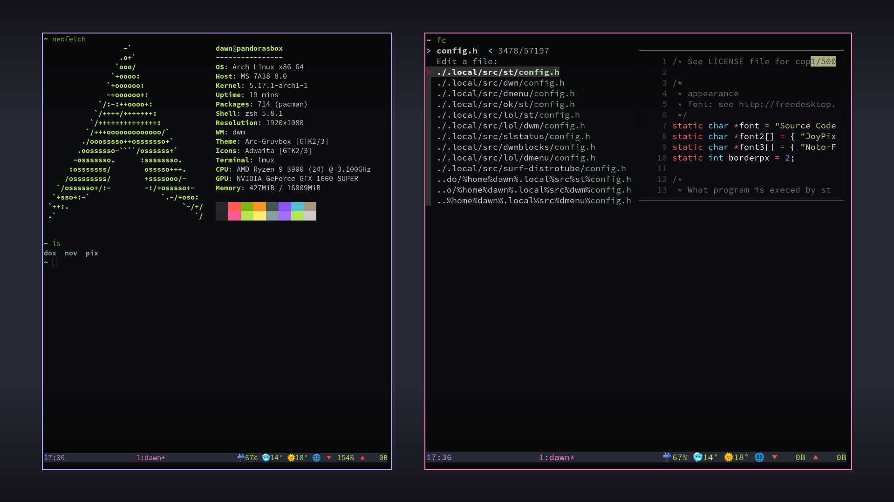

# .dotfiles
<h3 align="center"></h3>

# Cool Things
I think my zsh prompt is pretty cool, as well as old versions of it that involved a live clock.

Say for myself, nothing here will really be of any use except maybe my .zathurarc or tmux config.

Deprecated scripts, such as for BSPWM, using lemonbar will probably be of little use to anyone, although they are still available.
Majority of config is based of voidrice, slight changes to init.vim. This is more for me to pull, when re-installing OS.
Most importantly useful scripts will be kept here.

# Cool software
Not all software here has config files per-se... but do have variables you can export.

- fzf
- vocage
- github-cli
- zathura
- nvim
- bat (cat rewrite)
- fcitx (input method)

# Old rices
Old rices, from 2-3 years ago,  
but we evolve 
